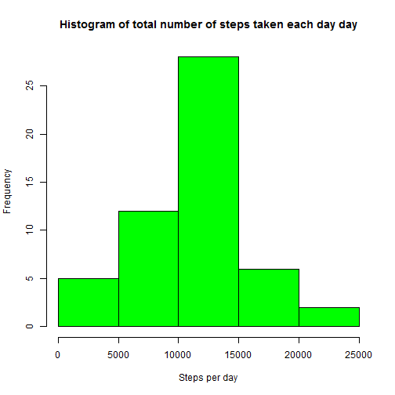
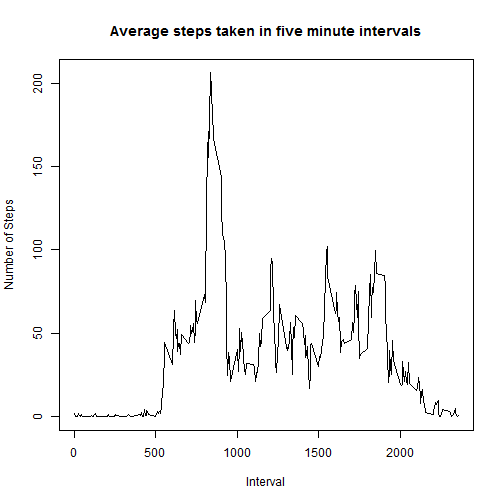

## Loading and preprocessing the data

```r
# load the graphics library
library(lattice)           
# set the number of digits when a floating point number is displayed
options(scipen = 1, digits = 2)
# read the data file
data <- read.csv("activity.csv")
# display statistics about the observations
summary(data)
```

```
##      steps              date          interval   
##  Min.   :  0    2012-10-01:  288   Min.   :   0  
##  1st Qu.:  0    2012-10-02:  288   1st Qu.: 589  
##  Median :  0    2012-10-03:  288   Median :1178  
##  Mean   : 37    2012-10-04:  288   Mean   :1178  
##  3rd Qu.: 12    2012-10-05:  288   3rd Qu.:1766  
##  Max.   :806    2012-10-06:  288   Max.   :2355  
##  NA's   :2304   (Other)   :15840
```

I decided that the data needs no pre-processing. The data is already in a tidy format.


## What is mean total number of steps taken per day?

```r
#calculate the total number of steps taken per day ignoring the unknown values
sub_data <- subset(data, !is.na(data$steps))
# group the subset data by day
steps_per_day <- aggregate(steps ~ date, sub_data, sum)
# display a histogram of the total number of steps taken each day
hist(steps_per_day$steps,main="Histogram of total number of steps taken each day day",col="green",xlab="Steps per day")
```

 

```r
# calculate the mean of the total number of steps taken each day
mean_steps_per_day <- mean(steps_per_day$steps)
# calculate the median of the total number of steps taken each day
median_steps_per_day <- median(steps_per_day$steps)
```

The mean number of steps taken per day is 10766.19 and the median is 10765.

## What is the average daily activity pattern?

```r
# calculate the mean of mean number of steps taken per interval
d <- aggregate(steps ~ interval, data, mean)

# plot a graph of the average number of steps taken per 5 minute interval
plot(d$interval,d$steps, type="l", xlab="Interval", ylab="Number of Steps",main="Average steps taken in five minute intervals")
```

 

```r
# calculate the largest average number of steps and which interval it occurs
m <- d[which.max(d$steps),]
# seperate the interval
m_interval <- m[1,1]
# seperate the number of steps
m_steps <- m[1,2]
```

The maximum number of steps, averaged across all the days in the dataset, is 206.17 which occurrs in the interval 835.

## Imputing missing values


```r
#  Calculate and report the total number of missing values in the dataset (i.e. the total # number of rows with NAs)
missing <- sum(is.na(data$steps))
```

The number of missing step values is 2304.

We need a simple strategy to calculate values to subsitute for the missing values.
I decided to use the mean of number of steps per interval.


```r
#    Devise a strategy for filling in all of the missing values in the dataset. The strategy does #not need to be sophisticated. For example, you could use the mean/median for that day, or the #mean for that 5-minute interval, 

# calculate a logical array which true is value is missing
nas <- is.na(data$steps)
# calculate a list of the means of the number of steps per interval
interval_means <- tapply(data$steps, data$interval, mean, na.rm=TRUE, simplify=TRUE)
```

#    Create a new dataset that is equal to the original dataset but with the missing data filled #in.

```r
# make a copy of the data set including the missing values
data_copy <- data
# subsitute the means for the missing values
data_copy$steps[nas] <- interval_means[as.character(data$interval[nas])]
# re-calculate the number of missing values in the new dataset (should be zero)
missing <- sum(is.na(data_copy$steps))
```
The number of missing step values is 0.


##    Make a histogram of the total number of steps taken each day and Calculate and report the ##mean and median total number of steps taken per day. Do these values differ from the estimates ##from the first part of the assignment? What is the impact of imputing missing data on the ##estimates of the total daily number of steps?

```r
full_steps_per_day <- aggregate(steps ~ date, data_copy, sum)
hist(full_steps_per_day$steps,main="Histogram of total number of steps taken each day",col="green",xlab="Steps per day")
```

 

```r
full_mean_steps_per_day <- mean(full_steps_per_day$steps)
full_median_steps_per_day <- median(full_steps_per_day$steps)
```

The mean number of steps taken per day is 10766.19 and the median is 10766.19.

To examine the impact of adding the missing values I have calculated the differences between the the means and medians.

```r
# calculate the differences between the means
mean_diff <- full_mean_steps_per_day - mean_steps_per_day
# calculate the differences between the medians
median_diff <- full_median_steps_per_day - median_steps_per_day
```

The differences between the means is 0 and the differences betwen the two medians is 1.19. As these values are zero and near zero the imputing of the missing values has have no effect on the observations.

## Are there differences in activity patterns between weekdays and weekends?

```r
# convert the date field from a string to a date format
data_copy$date <- as.Date(data$date)
#create a vector of weekdays
daysNames <- c('Monday', 'Tuesday', 'Wednesday', 'Thursday', 'Friday')
# Create a logical vector and then change the logical values to factors represting day type
#convert to `factor` and specify the `levels/labels`
data_copy$dayType <- factor((weekdays(data_copy$date) %in% daysNames),levels=c(FALSE,TRUE),labels=c('weekend','weekday'))                            

# calculate the means of the number of steps taken per interval subdivided by day type
avg_steps_dayType <- aggregate(steps ~ interval + dayType, data_copy, mean)

# plot two graphs showing average number of steps taken per interval for each of the dat type
xyplot(avg_steps_dayType$steps ~ avg_steps_dayType$interval|avg_steps_dayType$dayType, main="Average Steps per Interval",xlab="Interval", ylab="Steps",layout=c(1,2), type="l")
```

 

The two graphs basically follow the same pattern. The largest number of steps takes place between intervals 500 to the 1000. The weekend raises slowly from the zero values but the non-zero values tend to be higher than the corresponding weekday values. 


